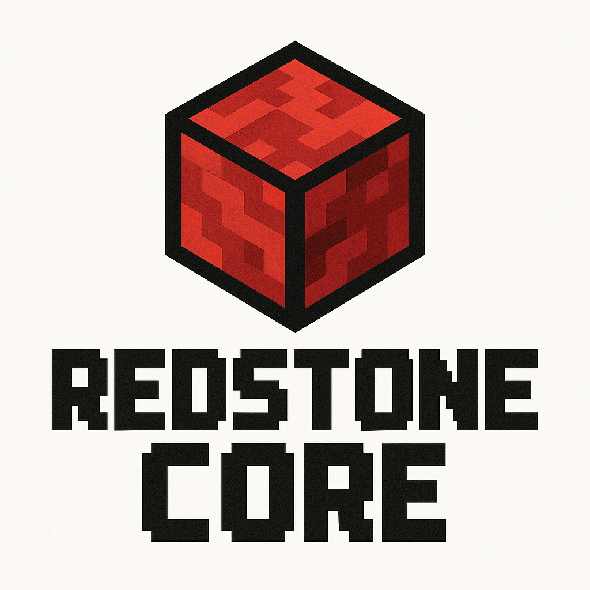

# RedstoneCore

<p align="center">
  
</p>

## Project Overview

A 5-stage, in-order RV32I core implementation.

## Architecture

## Supported Instructions

## Project Structure

```
redstoneCore/
|-- docs/
|   |-- core.drawio
|   |-- redstoneCore.png
|-- rtl/
|   |-- dff/
|   |   |-- dff.sv
|   |   |-- dff_test.py
|   |   |-- filelist.json
|   |   |-- Makefile
|-- submodules/
|   |-- imports/
|-- syn/
|   |-- icebreaker/
|   |   |-- icebreaker.pcf
```
