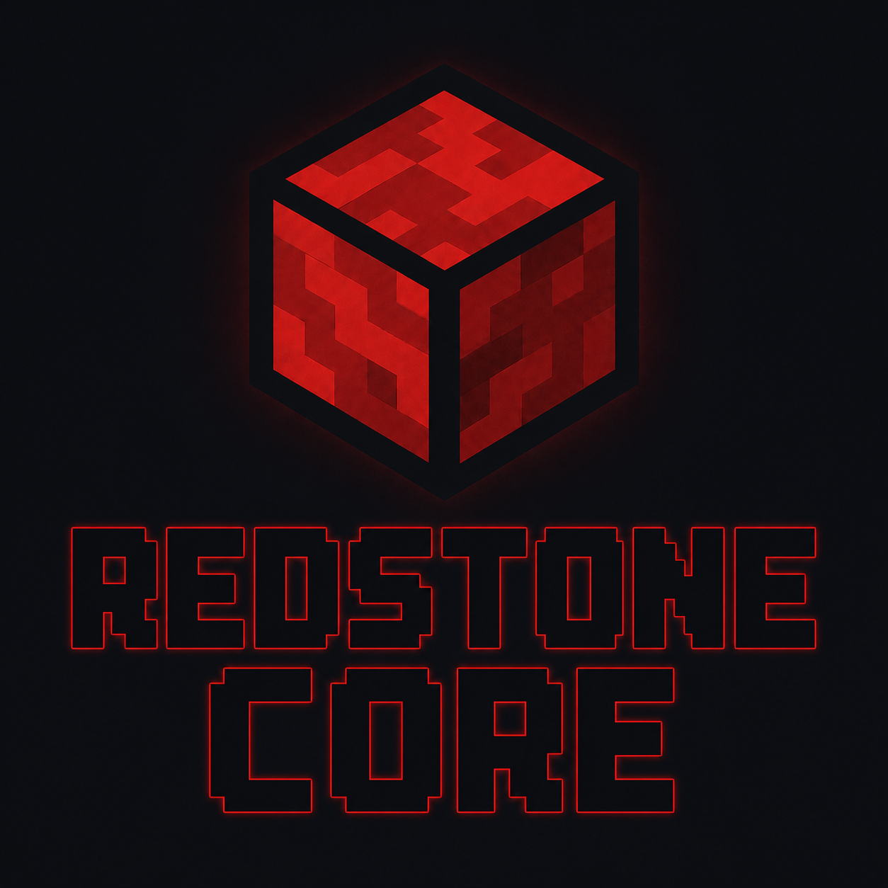

# RedstoneCore

<p align="center">
  
</p>

RedstoneCore is a 5-stage, in-order RV32I core written in SystemVerilog.

This checkpoint is the base integer core: fetch, decode, execute, memory, writeback, hazard handling, branch prediction, split instruction/data caches, AXI-Lite memory access, and a top-level simulation wrapper with unified dual-port RAM.

## Current ISA

Supported now:

- `RV32I`
- 32-bit aligned instruction fetch
- byte, halfword, and word load/store data paths
- branch and jump control flow
- `FENCE` as an in-order no-op for base `RV32I`

Future target:

- `Zicsr` for CSR instructions and machine trap groundwork
- `M` for multiply/divide
- `C` for compressed instructions
- `A` for atomics
- `B` for bitmanip
- `Zifencei` for self-modifying code support

## Architecture

<p align="center">
  
</p>

Pipeline:

- IF: PC generation, BTB prediction, instruction cache request, prefetch FIFO
- ID: decode, register file read, hazard detection, load-use scoreboard
- EX: ALU, branch/jump resolution, forwarding
- MEM: load/store formatting, data cache access, writeback source selection
- WB: register file writeback

Memory system:

- Split instruction and data cache
- Two AXIL master controllers
- Shared Dual Port RAM
- Prefetch FIFO Buffer in IF

## Quick Start

Compile and run all tests:

```sh
# Compile test programs
cd programs/rv32i && make && cd ../compliance_I && make && cd ../..

# Run tests from rtl/top
cd rtl/top
make python          # Unit tests (RTL components)
make CUSTOM          # Custom rv32i functional tests
make COMPLIANCE_I    # Official RV32I compliance tests
```

See `programs/README.md` for details on test structure and regenerating compliance signatures with Sail.

**Current status**: All 39 `COMPLIANCE_I` tests pass. All custom functional tests pass.

## Project Structure

```text
redstoneCore/
|-- docs/                         # Diagrams and documentation
|-- programs/
|   |-- rv32i/                    # Custom C-based functional tests
|   |-- compliance_I/             # Official RV32I compliance tests (ACT4)
|-- rtl/                          # SystemVerilog modules
|   |-- alu/
|   |-- axil_master/
|   |-- branch_target_buffer/
|   |-- decode/
|   |-- dm_cache/
|   |-- ex_stage/
|   |-- hazard_unit/
|   |-- id_stage/
|   |-- if_stage/
|   |-- mem_stage/
|   |-- regfile/
|   |-- top/                      # Top-level testbench
|   |-- pkg.sv
|-- submodules/imports/           # External modules (FIFO, RAM)
|-- syn/icebreaker/               # Synthesis config
```
